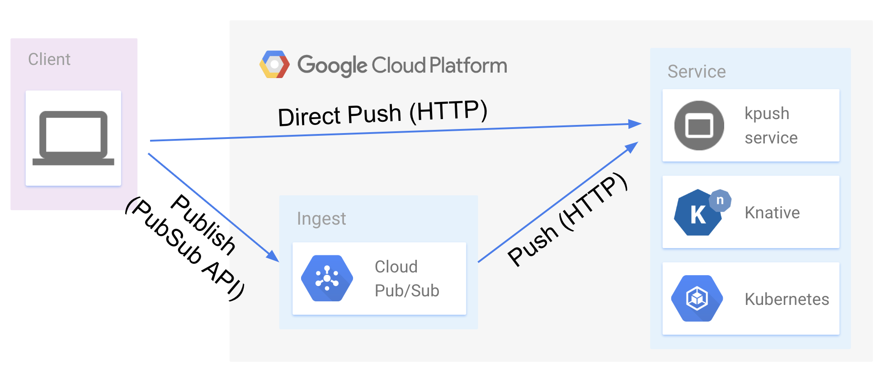

# kpush - push signed messages from PubSub to Knative service

> WIP: document not finished

## Why kpush

> NOTE: this is personal project for demonstration only

Because Webhooks most of the time is send data across public network, developers need to assure that the event was submitted from a valid source, and ideally, that the content of the event (the data) has not been tempered with in transit. This is where `kpush` comes in.



This end-to-end pipeline will demo pushing signed event data from [GCP Cloud PubSub](https://cloud.google.com/pubsub/) to a custom service hosted on an instance of the [Knative](https://github.com/knative/).

## Setup

To setup this demo will configure following components:

* The processing service on Knative
* Topic and Subscription on PubSub

### Service on Knative

// TODO: link to how to setup Knative

// TODO: instructions on how to deploy service

### Topic and Subscription on PubSub

> See [this instructions](https://cloud.google.com/pubsub/docs/push) for how to registering endpoints

// TODO: instructions on how to create topic

// TODO: instructions on how to create subscription

* https://cloud.google.com/pubsub/docs/subscriber

> Target of your PubSub push must be an HTTPS server with non-self-signed certificate


### Configure Client

// TODO: instructions on how to configure client and send data

```push
{
    "message": {
        "attributes": {
            "sig": "sha1=22c477fd1269c9d3bab8591b371a66976f10006e"
        },
        "data": "eyJpZC...",
        "messageId": "333651121184341",
        "publishTime": "2018-12-22T19:05:01.067Z",
    },
    "subscription": "projects/${PROJECT_ID}/subscriptions/pusheventing-push"
}
```


