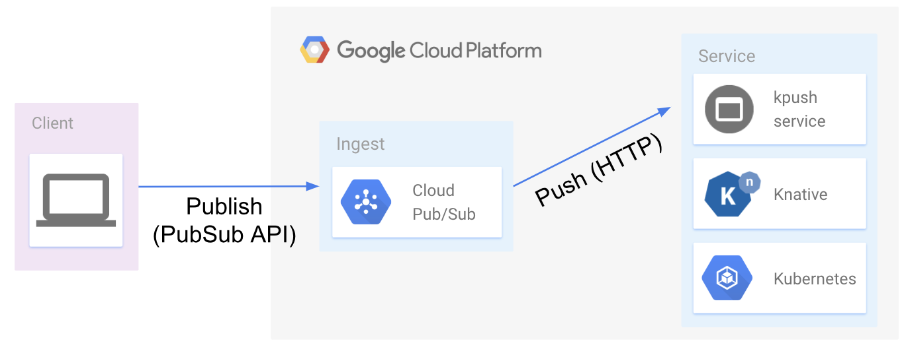
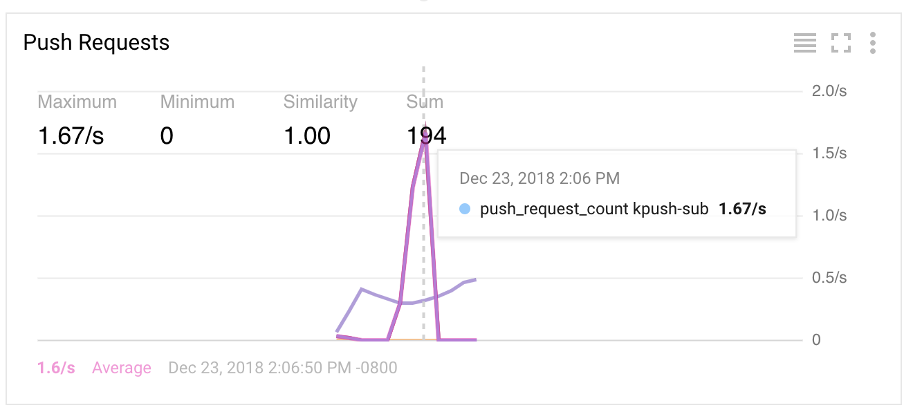

# kpush - push signed messages from PubSub to Knative service

> WIP: document not finished

> NOTE: this is personal project for demonstration only

## Why

[GCP Cloud PubSub](https://cloud.google.com/pubsub/) is a common component of data flow pipelines. It creates Global and elastic separation between the data provider and data consumers. One of PubSub's features is an ability to [push](https://cloud.google.com/pubsub/docs/push) subscription which sends messages to the configured `webhook`. Consider this data flow.



The `kpush` client publishes messages to PubSub `topic` which PubSub `subscription` then pushes to processing services, in this case an app hosted on an instance of `Knative`. This process is well [documented](https://cloud.google.com/pubsub/docs/push) including way of including [token](https://cloud.google.com/pubsub/docs/faq#security) in PubSub POST query string to ensure that only submissions from valid senders are processed by our service.

`kpush` demonstrates how to add an additional level of validation by signing each message and validating that signature on the service side. The below sample illustrates the `sig` attribute which is appended to each message with the [SHA-1](https://en.wikipedia.org/wiki/SHA-1) of the `message.data` payload.

```json
{
    "message": {
        "attributes": {
            "sig": "sha1=22c477fd1269c9d3bab8591b371a66976f10006e"
        },
        "data": "eyJpZC...",
        "messageId": "333651121184341",
        "publishTime": "2018-12-22T19:05:01.067Z",
    }
}
```

## Setup

The `kpush` flow includes two components: `client`, generating, signs, and publishing mocked up messages, and `server` which receives PubSub pushed messages and validates their signature.

> Assuming `gcloud` SDK already configured. See [gcloud docs](https://cloud.google.com/sdk/gcloud/) for instructions if you need assistance

### PubSub topic

Lets start by creating the PubSub topic named `kpush` to which our client will be publishing messages.

```shell
gcloud pubsub topics create kpush
```

The response should be

```shell
Created topic [projects/YOUR_PROJECT_ID/topics/kpush].
```

### Knative Service

The installation and configuration of [Knative](https://github.com/knative) is beyond the scope of this readme but you can find detail instructions how to configure it on [Kubernetes](https://kubernetes.io/) service offered by most Cloud Service Providers [here](https://github.com/knative/docs/tree/master/install). In this example I will be using Google's [Kubernetes Engine](https://cloud.google.com/kubernetes-engine/) (GKE) which can be easily configured with the validated version of Knative with a single checkbox.

To quickly build Kantive service image you use use the [GCP Build](https://cloud.google.com/cloud-build/) service.

```shell
gcloud builds submit \
    --project ${GCP_PROJECT_ID} \
	--tag gcr.io/${GCP_PROJECT_ID}/kpush-server:latest
```

The build service is pretty verbose in output but aventually you should see something like this

```shell
ID           CREATE_TIME          DURATION  SOURCE                                   IMAGES                      STATUS
6905dd3a...  2018-12-23T03:48...  1M43S     gs://PROJECT_cloudbuild/source/15...tgz  gcr.io/PROJECT/kpush-server SUCCESS
```

The `IMAGE` column will have the repository URI for your new image (e.g. `gcr.io/PROJECT/kpush-server`)

Before we can deploy that service to Knative, we just need to update the `deploy/server.yaml` file

First, update the container `image` to the URI from the build `IMAGE` column value. Then update the two environment variables values:

* `KNOWN_PUBLISHER_TOKENS` which holds the token we will use in PubSub URL
* `MSG_SIG_KEY` which should be the key used by your clients to sign published messages

> Note, `KNOWN_PUBLISHER_TOKENS` may include many tokens separated my comma

Finally, to deploy `kpush` service to Knative apply the updated deployment using following command:

```shell
kubectl apply -f deploy/server.yaml
```

The response should be

```shell
service.serving.knative.dev "pushme" configured
```

To check if the service was deployed succesfully you can check the status using `kubectl get pods` command. The response should look something like this (e.g. Ready `3/3` and Status `Running`).

```shell
Should re
NAME                                          READY     STATUS    RESTARTS   AGE
pushme-00002-deployment-5645f48b4d-mb24j      3/3       Running   0          4h
```

Knative uses convention to build serving URL by combining the deployment name (e.g. `pushme`), namespace name (e.g. `demo`), and the pre-configured domain name (e.g. `knative.tech`). The resulting URL should look something like this

```shell
https://pushme.default.knative.tech
```

Go ahead, test it in browser, you should following JSON response:

```json
{ "handlers": [ "POST: /post" ] }
```

Target of PubSub push must also be an HTTPS server with non-self-signed certificate. The instructions on how to configure Knative with SSL certificate are are located [here](https://github.com/knative/docs/blob/master/serving/using-an-ssl-cert.md).

> Note, PubSub will publish only to registering endpoints which will require you to A) Verify you have access to the domain, and B) Register your domain in APIs & services. Instructions for both can be set up [here](https://cloud.google.com/pubsub/docs/push)

### PubSub Subscription

The final component we need to set up is the PubSub subscription which will push messages to our Knative hosted service. the `MYTOKEN` should be set to one of the tokens you defined in the Knative service manifest environment variables (`KNOWN_PUBLISHER_TOKENS`).

```shell
gcloud pubsub subscriptions create kpush-sub \
    --topic kpush \
    --push-endpoint https://pushme.demo.knative.tech/push?publisherToken=${MYTOKEN} \
    --ack-deadline 30
```

> Note, cold-starts on Knative can be sometimes slow so we added the `ack-deadline=30` parameter. For additional info on PubSub subscription options see this [doc](* https://cloud.google.com/pubsub/docs/subscriber)


## Run

To demo the entire pipeline, `kpush` includes a client which will mock up a few messages, sign them, and submit them to the configured topic.

Navigate to the `client` directory...

```shell
cd cmd/client
```

...and run the following command:

```shell
go run main.go --project ${GCP_PROJECT_ID} \
               --key ${MSG_SIG_KEY} \
               --topic kpush
```

The response should look something like this

```shell
2018/12/23 13:58:44 Using topic publisher: YOUR-GCP-PROJECT-NAME:kpush
   status: published msg[0] eacc9be0-06fd-11e9-868f-acde48001122
   status: published msg[1] eb2e0cae-06fd-11e9-868f-acde48001122
   status: published msg[2] eb39aaa0-06fd-11e9-868f-acde48001122
sent 3 messages
```

### Monitoring

A successful end-to-end run of the pipeline will result in `202` status code from the Knative hosted service. To validate you can either query the Knative logs or navigate to the [GCP Stackdriver](https://cloud.google.com/stackdriver/) console to review the PubSub subscription panel (Resources > PubSub > Subscriptions)



## Direct Push

`kpush` also includes an `HTTPPublisher` which can skip the PubSub entirely and submit signed messages directly to the Knative service. To do that include `url` parameter in the `kpush client` command like this

```shell
go run main.go --project ${GCP_PROJECT_ID} \
               --key ${MSG_SIG_KEY} \
               --url https://pushme.demo.knative.tech/push?publisherToken=${MYTOKEN} \
               --messages 10
```

## Disclaimer

This is my personal project and it does not represent my employer. I take no responsibility for issues caused by this code. I do my best to ensure that everything works, but, if something goes wrong, my apologies is all you will get.

